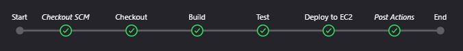
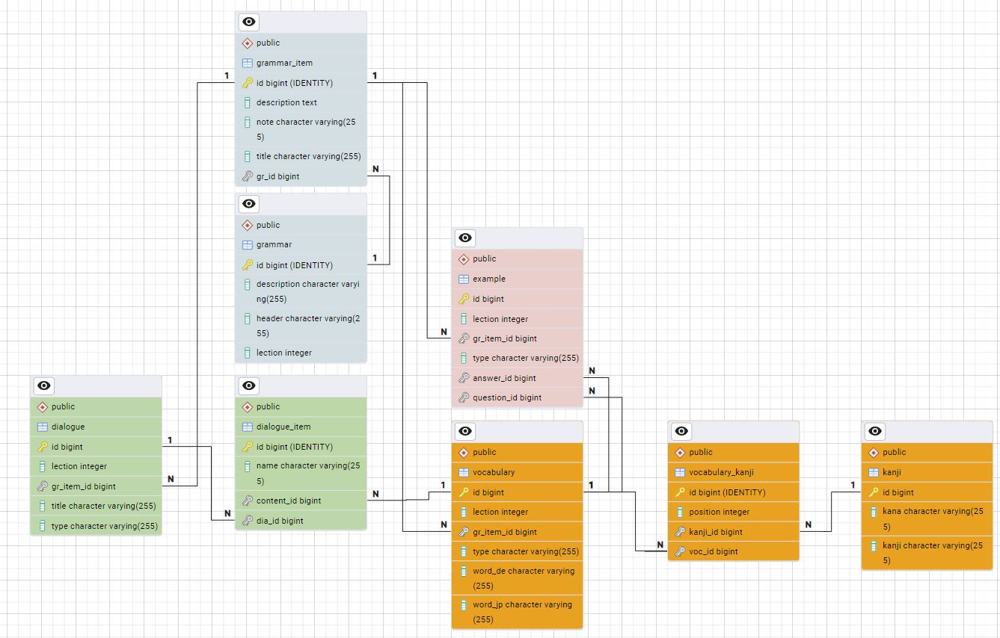

# 🌸 Jagua Backend Logic
Backend REST API for Jagua. Frontend logic is maintened in the following repository:
- https://github.com/Hungpai/Jagua

## Demo
Deployed on AWS with EC2 and RDS:
- https://jagua.hungpy.de/

## Features
- REST API
- GET Endpoints

## Technologies
- Java 17
- Spring Boot
- Spring Data JPA
- Spring Web
- JUnit
- PostgreSQL

## CI/CD
Jenkins Pipeline stages:
1. Checkout
2. Build
3. Test
4. Deploy



## Database
- Vocabulary &harr; Kanji: Many-To-Many (via. vocabulary_kanji table)
- Example &harr; Vocabulary: Many-To-One (x2)
- Dialogue &harr; DialogueItems: One-To-Many 
- DialogueItems &harr; Vocabulary: Many-To-One
- Grammar &harr; GrammarItems: One-To-Many
- GrammarItems has a polymorphic structure:
  - GrammarItems &harr; Vocabulary: One-To-Many
  - GrammarItems &harr; Example: One-To-Many
  - GrammarItems &harr; Dialoge: One-To-Many
  


## Cloud
Deployed on AWS using RDS, EC2, ALB, S3, Route 53, CloudFront and Certificate Manager.


## Unit Tests
Unit tests written for Controller Classes using the Arrange/Act/Assert pattern, ensuring expected endpoint and data returns. Example from ``test/java/com/hung/jagua/JaguaControllerTest.java``
```java
@Test
void testGetPatternByLection() throws Exception {
    // Arrange
    int lection = 1;
    Type type = Type.PATTERN;
    List<Vocabulary> dummyPattern = Arrays.asList(
      new Vocabulary(
        type, 
        List.of(), 
        "わたしは マイク・ミラーです。", 
        "Ich heiße Mike Miller."
      )
    );
    when(vocabularyRepository
      .findAllByLectionAndTypeOrderById(lection, type))
      .thenReturn(dummyPattern);

    // Act
    ResultActions result = mockMvc
      .perform(get("/lection/pattern/{lection}", lection));

    // Assert
    result.andExpect((status().isOk()))
            .andExpect(jsonPath("$.length()")
            .value(dummyPattern.size()));
}
``` 
